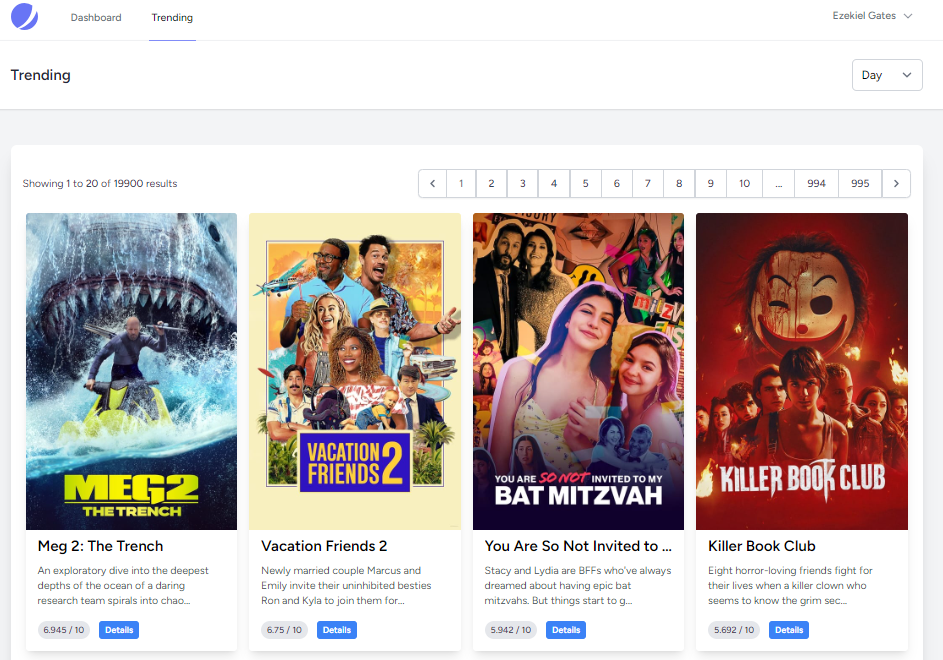
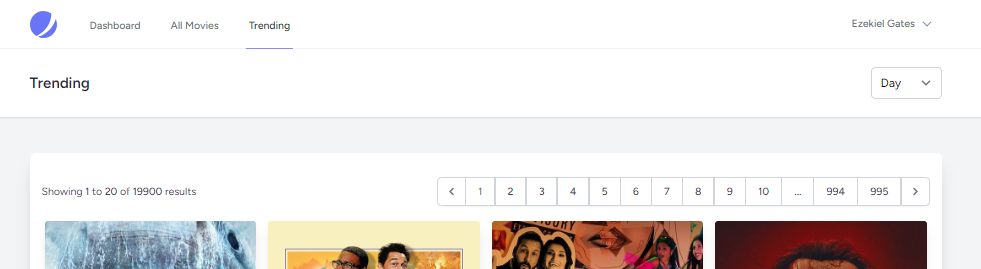

# Laravel Movie Project

This project uses the Laravel framework to consume The Movie DB API to fetch and display trending movies and their details. The data can also be saved to a local database through an artisan command.

## Requirements
- PHP >= 8.0
- Composer
- Laravel CLI
- Database (MySQL, PostgreSQL, SQLite, etc.)

## Installation

### 1. Clone the repository:

```bash
git clone https://github.com/yourusername/movie_project.git
cd movie_project
```

### 2. Install the dependencies:

```bash
composer install
```

```bash
npm install
```

### 3. Setup environment variables:

Copy `.env.example` to `.env`:

```bash
cp .env.example .env
```

Update the database configurations and add your The Movie DB API key:

```env
DB_CONNECTION=mysql
DB_HOST=127.0.0.1
DB_PORT=3306
DB_DATABASE=your_database_name
DB_USERNAME=your_username
DB_PASSWORD=your_password

TMDB_API_KEY=your_api_key_here
```

### 4. Run migrations:

This will create the necessary tables in your database.

```bash
php artisan migrate
```

### 5. Serve the application:

```bash
php artisan serve
```

```bash
npm run dev
```

Your application should now be running at [http://127.0.0.1:8000](http://127.0.0.1:8000).

## Usage

### Create new user account

Using Jetstream, you will be prompte to login first, Please create your account to have access to dashboard or any other page.

### View Dashboard:

Visit `http://127.0.0.1:8000/` : Introduction with all features availble in the web app.


### View Trending Movies:

Visit `http://127.0.0.1:8000/movies/trending`

#### With Pagination & Period

Visit `http://127.0.0.1:8000/movies/trending?page=1&period=week`

#### View DB stored movies

Should be accessible only if the movies in db are availble. protected with middleware.
Visit `http://127.0.0.1:8000/movies`

Before fetching movies

Aafter fetching movies


### View Movie Details:

Click on a specific movie from the trending list or visit `http://127.0.0.1:8000/movies/{movieId}`


### command Kernel:

Run the artisan command fetch:movies to get and save the trending movies from the API to database.

```Bath
php artisan fetch:movies
```


Run the artisan command delete:movies to delete all movies in database.

```Bath
php artisan delete:movies
```

## Contributing

1. Fork the repository.
2. Create a new branch for each feature or improvement.
3. Send a pull request from each feature branch to the `develop` branch.

## License

This project is open-sourced software licensed under the [MIT license](https://opensource.org/licenses/MIT).